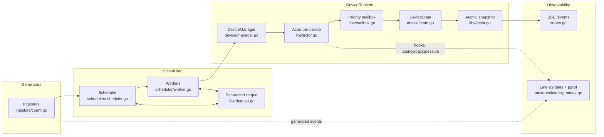

# iot_data_collection

[](https://go.dev/dl/)
[](#run-it)
[](#run-it)

A Go simulator for actor-style IoT telemetry processing: per-device mailboxes, sharded workers, backpressure, SSE delivery, and runtime metrics.

It is useful as a concurrency playground and as a load testbed for scheduling, queueing, and in-memory state updates.

## What It Does

- Generates synthetic telemetry, alarms, and commands for a large set of simulated devices.
- Routes each message through a per-device actor that owns its state.
- Uses priority mailboxes and a shared worker deque so busy devices do not monopolize a worker.
- Exposes the latest snapshot for the analysis sensor over Server-Sent Events.
- Prints latency, backlog, GC, and mailbox backpressure metrics while the program runs.
- Serves `pprof` on `localhost:6060` for profiling.

## Components

| Component | Path | Responsibility | Connects to |
|---|---|---|---|
| Bootstrap | `main.go` | Configures logging, allocates the actor pool, creates devices, and starts the scheduler, SSE server, and metrics loop. | `scheduler`, `server.go`, `mesures` |
| Message generators | `injestors/count.go` | Produces synthetic telemetry, alarm, and command messages on timers. | `scheduler.Worker` |
| Scheduler | `scheduler/scheduler.go` | Creates one worker per CPU and assigns each worker a device range. | `scheduler.Worker`, `libs.Deque` |
| Worker | `scheduler/worker.go` | Pulls generated messages, sends them to the target device, and updates queued actors. | `device.DeviceManager`, `libs.Actor` |
| Actor runtime | `libs/actor.go`, `libs/mailbox.go`, `libs/pool.go` | Holds the mailbox, publishes atomic snapshots, and reuses state objects. | `device.DeviceState`, `device.Apply` |
| Device model | `device/manager.go`, `device/state.go` | Stores devices and applies telemetry updates to device state. | `libs.Actor`, `device/messages` |
| SSE server | `server.go` | Streams the latest snapshot for `SENSOR_OF_ANALYSIS_ID` at `/events`. | `device.DeviceManager` |
| Metrics | `mesures/latency_states.go` | Tracks latency, backlog, GC, and backpressure, and starts the `pprof` server. | `config`, `runtime`, `net/http/pprof` |

## Architecture



## Run It

Requirements:

- Go `1.26.4` or newer.
- A terminal that can keep a long-running process open.
- Optional: `curl` or a browser to inspect the SSE stream.

Start the simulator from the repository root:

```bash
go run .
```

Then open:

- `http://localhost:8080/events` for SSE updates
- `http://localhost:6060/debug/pprof/` for profiling

To watch the event stream from the terminal:

```bash
curl -N -H "Accept: text/event-stream" http://localhost:8080/events
```

Example frame:

```text
data: {"Data":{"Temperature":0,"Humidity":0,"Battery":0,"Noise":0},"Online":true}
```

## Demo

The fastest way to see the system working is to run the simulator and stream the analysis device:

```bash
go run .
```

In a second terminal:

```bash
curl -N -H "Accept: text/event-stream" http://localhost:8080/events
```

You should see one SSE frame per second with the latest snapshot for the configured analysis device. A typical sequence looks like this:

```text
data: {"Data":{"Temperature":0,"Humidity":0,"Battery":0,"Noise":0},"Online":true}
data: {"Data":{"Temperature":1,"Humidity":1,"Battery":1,"Noise":1},"Online":true}
data: {"Data":{"Temperature":2,"Humidity":2,"Battery":2,"Noise":2},"Online":true}
```

If you want to inspect runtime behavior while the stream is running, open:

- `http://localhost:6060/debug/pprof/`
- the structured logs printed by `mesures/latency_states.go`

## Configuration

Current runtime settings live in [`config/configuration.go`](config/configuration.go):

| Constant | Default | Purpose |
|---|---:|---|
| `NUM_CPUS` | `1` | Sets `GOMAXPROCS` and the number of scheduler workers. |
| `SENSOR_OF_ANALYSIS_ID` | `0` | Device exposed through `/events`. |
| `MAILBOX_SIZE` | `50` | Capacity of each priority lane in the mailbox. |
| `PRINT_TELEMETRY` | `10s` | Interval used by the metrics loop. |
| `SENSOR_PER_WORKER` | `1_500_000` | Number of simulated sensors assigned to each worker. |
| `QUANTUM` | `10` | Reserved tuning constant for worker quantum-based processing. |

The total simulated device count is `NUM_CPUS * SENSOR_PER_WORKER`.

## How It Works

1. `main.go` sets up logging, allocates a `sync.Pool` for `device.DeviceState`, creates the `DeviceManager`, and registers all devices.
2. `scheduler.Scheduler` spawns one `Worker` per CPU and gives each worker a device range plus a generator.
3. `injestors/count.go` emits telemetry, alarm, and command messages on timers and sends them into the worker.
4. `libs.Actor` pushes messages into a four-lane priority mailbox, applies them to a pooled state object, and publishes an atomic snapshot for readers.
5. `server.go` reads the latest snapshot for `SENSOR_OF_ANALYSIS_ID` and streams it through `/events`.
6. `mesures/latency_states.go` records processing latency, backlog, and backpressure, prints periodic metrics, and starts `pprof` on `localhost:6060`.

The system is intentionally in-memory and ephemeral. It does not persist telemetry to disk or to a database.

## Current Status

This repository is still evolving. The roadmap in [`TODO.md`](TODO.md) currently includes:

- alarm priority over telemetry
- weighted priority scheduling
- per-device ordering guarantees
- coalescing duplicate updates
- rate limiting per device
- deadline-aware scheduling

## Notes

- The mailbox currently has four priority lanes and always drains the highest-priority lane first.
- The SSE endpoint streams the current snapshot for the configured analysis device, not a historical event log.
- `QUANTUM` is defined in configuration, but the current worker loop still processes one message per `Update(1)` call.
